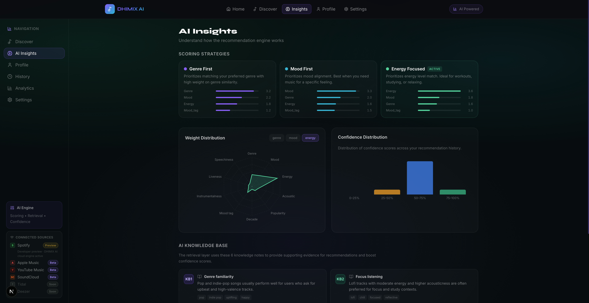
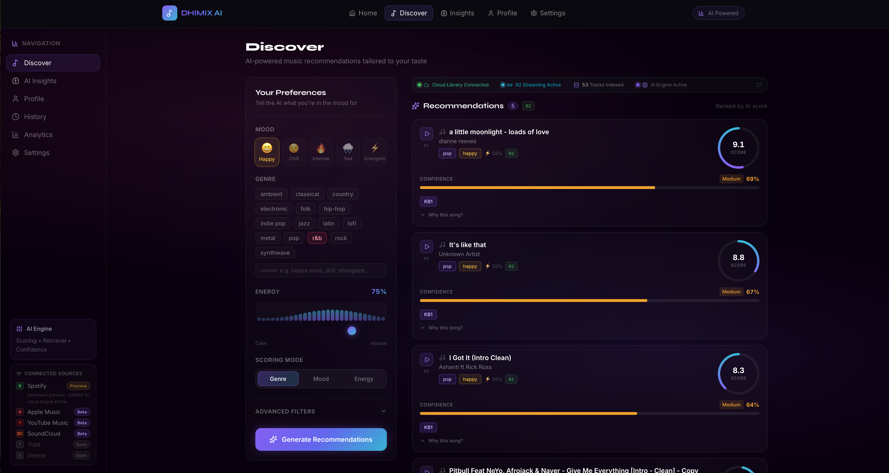
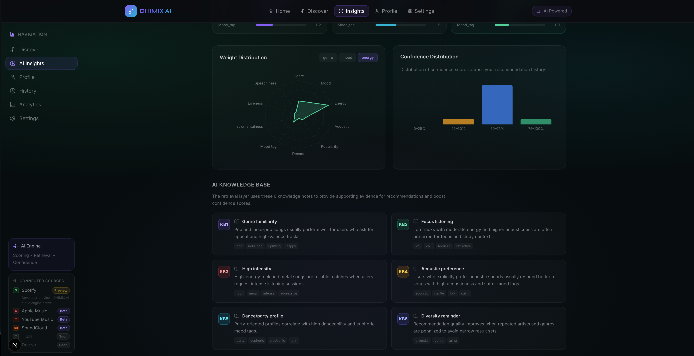
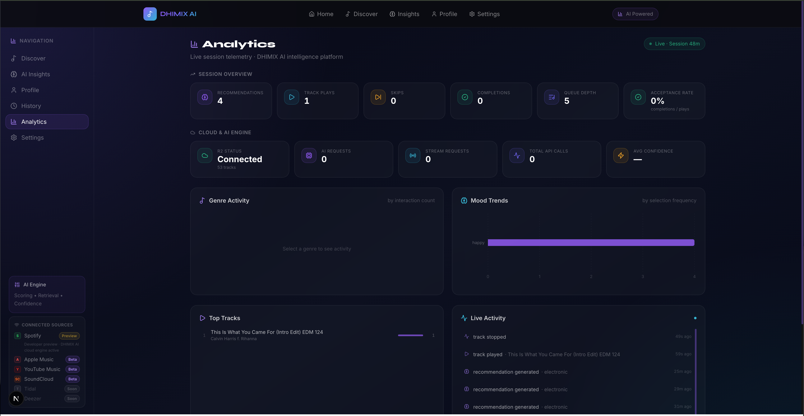
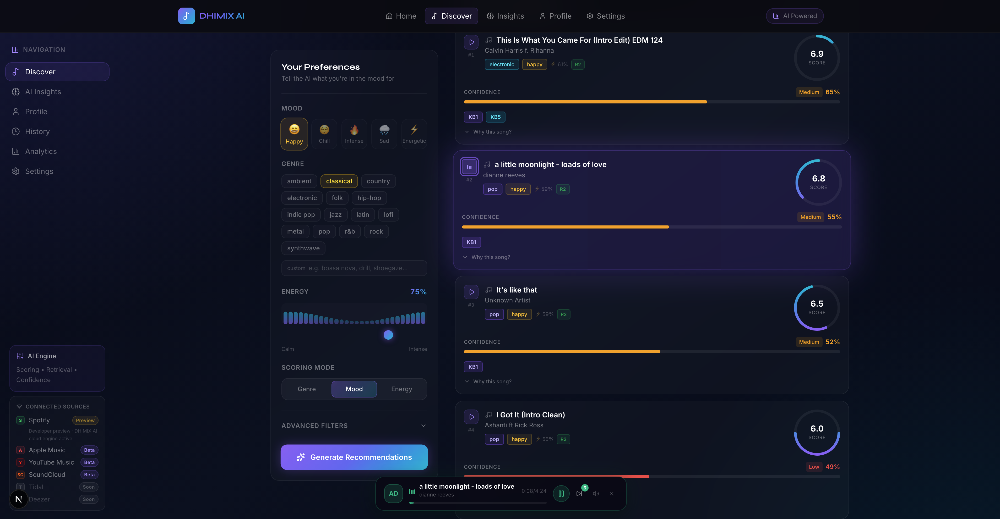
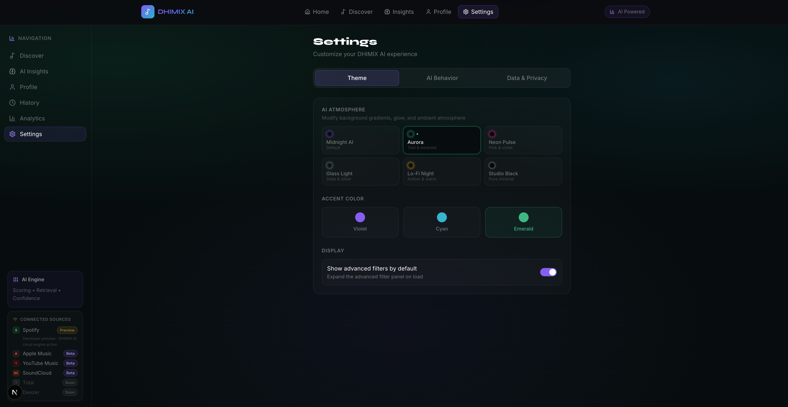

<div align="center">



# DHIMIX AI

### AI-Native Music Intelligence Platform

**DHIMIX AI helps listeners discover music through transparent AI recommendations that explain mood, energy, confidence, and fit.**

*Music expertise meets AI engineering.*

[](https://nextjs.org)
[](https://www.typescriptlang.org)
[](https://python.org)
[](https://fastapi.tiangolo.com)
[](https://developers.cloudflare.com/r2)
[](https://vercel.com)
[]()
[](LICENSE)

[Try It Free](#get-started) · [What's Different](#what-makes-dhimix-ai-different) · [Architecture](#system-architecture) · [Pricing](#free-tier--pricing) · [Contact](#contact)

> *"Explainability is not a feature. It is architecture."*

</div>

---

## Get Started

**DHIMIX AI is free to use. No account required.**

→ **[dhimix-ai.vercel.app](https://dhimix-ai.vercel.app)**

Open the platform, set your mood and energy, and get AI-powered music recommendations with full reasoning surfaced on every result. Your preferences, favorites, and listening history are stored locally in your browser — nothing is sent to a server.

---

## Overview

DHIMIX AI is a live music intelligence platform where every recommendation is transparent. Each result surfaces a composite score, confidence tier, knowledge-base evidence, and structured reasoning — so listeners understand not just *what* they're hearing, but *why* the system chose it.

The platform streams from the **Jamendo open music catalog** (Creative Commons licensed tracks from independent artists worldwide) and a **Cloudflare R2 Cloud Showcase** (a curated streaming collection), with an optional experimental Spotify profile enrichment layer — delivered through a dark AI-native interface built with Next.js 16, TypeScript, and Framer Motion.

---

## Who DHIMIX AI Is For

- **Music listeners** who want to understand why a track was recommended, not just receive one
- **Independent artists and curators** who care about licensing transparency and catalog provenance
- **Developers** building or studying full-stack recommendation architectures — from scoring engine to streaming UI
- **Students and researchers** exploring explainable AI, retrieval pipelines, and confidence scoring in a deployed system
- **Technical collaborators** who want to extend the recommendation engine, metadata layer, or analytics pipeline

---

## Free Tier & Pricing

### Free Tier — Available Now

Everything currently live in DHIMIX AI is free. No account, no credit card, no data collection.

| Feature | Status |
|---------|--------|
| AI Music Recommendations | Live |
| Jamendo Open Music Catalog | Live |
| Cloud Showcase Streaming | Live |
| Explainable AI — score + confidence + evidence + reasoning | Live |
| 3 AI Scoring Modes (Genre-First · Mood-First · Energy-Focused) | Live |
| Music DNA preference learning | Live |
| Favorites — persisted across sessions | Live |
| Listening History — last 100 tracks | Live |
| License Center — per-track licensing status | Live |
| Analytics Dashboard | Live |

### Pro Tier — In Development

| Feature | Status |
|---------|--------|
| Advanced Music DNA with session modeling | In Development |
| AI Listening Journeys (curated mood-to-mood sequences) | In Development |
| User accounts with cloud sync | Planned |
| Cross-device favorites and history | Planned |
| Advanced analytics and listening insights | Planned |
| Premium personalization and re-ranking | Planned |

Interested in Pro? [Join the waitlist](mailto:dhimixentertainment@gmail.com?subject=DHIMIX%20AI%20Pro%20Waitlist)

---

## Why DHIMIX AI Exists

Most music recommendation systems were built by software engineers studying listening behavior through data. DHIMIX AI was built by someone who spent years *inside* the music — behind the decks, on stage with a violin, in every room reading the crowd in real time.

After years as a professional DJ and musician, a pattern became clear: the platforms people relied on for music discovery were either **opaque** or **generic**. They recommended tracks based on aggregate data patterns but could not explain *why* a particular track fit a moment, a mood, or a room. They had no concept of energy trajectory, the emotional weight of a chord change, or why a 98 BPM groove lands differently at 11pm than at 7pm.

That gap — between how algorithms think about music and how musicians think about music — is the reason DHIMIX AI was built.

- Build a recommendation engine informed by *real music selection expertise*, not just statistical co-occurrence
- Make the reasoning **transparent** — every recommendation explains itself
- Deliver it as a live platform that anyone can use

---

## What Makes DHIMIX AI Different

| Traditional Platforms | DHIMIX AI |
|----------------------|-----------|
| Optimize for engagement | Optimizes for understanding |
| Black-box recommendation algorithms | Scoring weights, confidence levels, and evidence sources are surfaced in the interface |
| "More like this" with no reasoning | Structured Why[] output per recommendation |
| Built by engineers studying listening data | Built by someone who made music selection decisions in real rooms for years |
| Confidence is hidden | Confidence is a first-class output — HIGH / MEDIUM / LOW on every result |
| No fallback transparency | Honest degradation messaging on low-signal inputs |

The core architecture is rule-based and auditable by design. Scoring is driven by explicit, deterministic logic that reflects real music expertise — not black-box model parameters. The system's reasoning is surfaced to the user at every step rather than buried inside gradient weights.

---

## From DJ Booth to AI Platform

Every phase of this journey left a traceable mark on the platform.

```
Professional DJ ──────── Reading crowds in real time. Understanding energy trajectories,
                          crowd psychology, and why the same track works at 10pm but not midnight.
                          → Informed the energy proximity scoring and multi-mode weight design.
        ↓
Violinist ────────────── Musical theory, harmonic structure, the physics of emotion in sound.
                          Understanding music at a technical level, not just a cultural one.
                          → Informed mood analysis and genre-energy relationship modeling.
        ↓
Music Curator ────────── Curation as craft. Every selection is an editorial decision.
                          Understanding that context — not just quality — determines fit.
                          → Informed the preference profile architecture and scoring mode design.
        ↓
Computer Science ─────── Formal foundation in algorithms, data structures, system design.
                          OOP, complexity analysis, reliable software construction.
                          → Informed retrieval pipeline design and evaluation methodology.
        ↓
AI Engineering ───────── Retrieval systems, confidence scoring, explainability, reliability testing.
                          Agentic development workflows used throughout implementation.
                          → Built the scoring engine, confidence system, and fallback architecture.
        ↓
DHIMIX AI ────────────── The synthesis. Music expertise encoded into transparent, inspectable AI.
                          A platform where the recommendation logic is as visible as the music itself.
```

This is not a story about a software engineer who discovered music. It is a story about a musician who built AI — and the difference is in every design decision.

---

## Engineering Highlights

*What DHIMIX AI is built on.*

| Capability | Implementation |
|-----------|---------------|
| **Full-Stack Architecture** | Next.js 16 frontend · FastAPI backend · Vercel edge deployment |
| **Explainable AI** | Score + confidence tier + evidence tags + Why[] on every recommendation |
| **Retrieval Pipeline** | Genre-filtered candidate retrieval from Jamendo API + R2 Cloud Showcase |
| **Composite Scoring** | Multi-weight, multi-dimension algorithm — 10 scoring features + DNA bias |
| **Confidence System** | Normalized score strength + knowledge-note retrieval bonus |
| **Cloud Streaming** | Cloudflare R2 signed URL delivery · Jamendo CDN direct streaming |
| **TypeScript Frontend** | TypeScript throughout · Zustand state · Framer Motion animations |
| **Python Backend** | FastAPI · scoring engine · evaluation harness · pytest suite |
| **Music Metadata Layer** | Structured track schema — title · artist · genre · mood · energy · license |
| **User Intelligence** | Music DNA preference vector · localStorage favorites + history persistence |
| **Analytics Platform** | Live telemetry — recommendations · playback events · confidence distribution |
| **License Transparency** | Per-track license status — reviewed / licensed / pending / unknown |
| **Reliability Tested** | 4/4 profiles passed · adversarial input stable · avg. confidence 0.599 |
| **Responsible AI** | Input guardrails · fallback transparency · no hidden confidence · model card |

---

## Platform Status

| System | Status |
|--------|--------|
| **Music Catalog** | Live — Jamendo (Creative Commons) + Cloudflare R2 Cloud Showcase |
| **Recommendation Engine** | Live — Genre-First · Mood-First · Energy-Focused |
| **Explainability** | Live — score + confidence + evidence + reasoning on every result |
| **Cloud Streaming** | Live — signed URL delivery, browser-playable |
| **Music DNA** | Live — cross-session preference learning |
| **Favorites & History** | Live — localStorage persistence, no account needed |
| **Analytics** | Live — playback telemetry · recommendation quality · session data |
| **License Center** | Live — per-track status for every catalog source |
| **Spotify Enrichment** | Experimental — optional OAuth profile enrichment (playback planned) |
| **Deployment** | Vercel global edge — [dhimix-ai.vercel.app](https://dhimix-ai.vercel.app) |

---

## Platform Screenshots

### Discover Dashboard
*Recommendation reasoning, confidence signals, and evidence sources surfaced directly in the interface — mood, genre, scoring mode, and evidence tags are inspectable on every result.*


---

### AI Insights Dashboard
*Weight distributions, confidence patterns, and knowledge-base signals make the scoring model readable rather than opaque.*


---

### Analytics Dashboard
*Observe recommendation quality, playback telemetry, and platform health in real time.*


---

### Streaming Experience
*AI recommendations connected directly to playback — persistent player, queue state, and live session controls.*


---

### Explainable AI Layer
*Score dial, confidence bar, knowledge-base evidence tags, and an expandable Why[] panel on every recommendation card.*


---

### Settings
*User control over the intelligence layer — AI behavior, theme, and data preferences without unnecessary complexity.*


---

## System Architecture

### Full Platform Architecture

```
┌─────────────────────────────────────────────────────────────────────────┐
│                         DHIMIX AI PLATFORM                              │
├────────────────┬────────────────────────────────────────────────────────┤
│  USER INPUT    │  Mood · Genre · Energy · Scoring Mode · Filters        │
├────────────────┼────────────────────────────────────────────────────────┤
│  NORMALIZATION │  Validate enums · Clamp energy [0,1] · Inject defaults │
├────────────────┼────────────────────────────────────────────────────────┤
│  RETRIEVAL     │  Jamendo API (primary) · R2 Cloud Showcase (secondary) │
│                │  Genre filter · Top-K candidates · Evidence attachment │
├────────────────┼────────────────────────────────────────────────────────┤
│  SCORING       │  Proprietary composite scoring engine                  │
│                │  10 dimensions · mode-weighted · Music DNA bias        │
├────────────────┼────────────────────────────────────────────────────────┤
│  CONFIDENCE    │  Proprietary confidence model · evidence-calibrated    │
│                │  HIGH ≥ 80% · MEDIUM 60–79% · LOW < 60%               │
├────────────────┼────────────────────────────────────────────────────────┤
│  RANKING       │  Sort DESC · Deduplicate artists/genres · Select top-N │
├────────────────┼────────────────────────────────────────────────────────┤
│  EXPLAINABILITY│  AI Score · Confidence bar · Evidence tags · Why[]     │
├────────────────┼────────────────────────────────────────────────────────┤
│  STREAMING     │  Jamendo CDN stream · R2 signed URL · Audio engine     │
├────────────────┼────────────────────────────────────────────────────────┤
│  FRONTEND      │  Next.js 16 · React 19 · TypeScript · Framer Motion   │
├────────────────┼────────────────────────────────────────────────────────┤
│  INFRASTRUCTURE│  Cloudflare R2 · Vercel Edge · FastAPI · Jamendo API   │
└────────────────┴────────────────────────────────────────────────────────┘
```

### Streaming Architecture

```
User selects track or recommendation triggers playback
         │
         ├── Jamendo track ──▶ Browser streams directly from Jamendo CDN
         │                     (stream URL resolved by recommendation API)
         │
         └── R2 track ──▶ Frontend requests signed URL via /api/stream/[key]
                               │
                               ▼
                          FastAPI generates time-limited Cloudflare R2 signed URL
                               │
                               ▼
                          Audio engine streams · player state + history updated
```

### Deployment Topology

```
User Browser (anywhere in the world)
     │
     ▼
Vercel Edge Network — Next.js 16 served globally
     │
     ├── /api/recommend ──▶ Hybrid catalog engine (Jamendo + R2)
     ├── /api/stream    ──▶ Cloudflare R2 signed URL generation
     ├── /api/catalog   ──▶ License catalog · health check
     └── /api/admin     ──▶ Analytics telemetry (FastAPI proxy)
                                    │
                        ┌───────────┴───────────┐
                        │                       │
               Jamendo API             Cloudflare R2
               (CC-licensed catalog)   (Cloud Showcase)
```

**Infrastructure note:** DHIMIX AI runs on Vercel's global edge network for frontend delivery and Cloudflare R2 for audio storage. This provides low-latency music streaming worldwide without managing servers. The architecture is designed to scale horizontally with demand.

---

## AI Recommendation Pipeline

```
INPUT: { mood, genre, energy: [0,1], scoring_mode }
  │
  ▼
NORMALIZATION
  Validate enums · Clamp energy to [0,1] · Inject defaults
  │
  ▼
CATALOG RETRIEVAL            [Jamendo API + R2 Cloud Showcase]
  Primary and secondary catalog fetch with genre-aware filtering
  Knowledge-base evidence attachment via tag-overlap matching
  │
  ▼
COMPOSITE SCORING            [Proprietary multi-factor engine]
  Candidate tracks evaluated across 10 signal dimensions:
  genre alignment · mood match · energy proximity · acoustic profile
  temporal context · catalog metadata signals · Music DNA bias
  Scoring weights shift per mode (Genre-First / Mood-First / Energy-Focused)
  Diversity constraints applied to maximize catalog breadth
  │
  ▼
CONFIDENCE CALCULATION       [Proprietary confidence model]
  Combines normalized signal strength with knowledge-base evidence
  retrieval into a calibrated per-recommendation confidence estimate
  HIGH ≥ 80% · MEDIUM 60–79% · LOW < 60%
  │
  ▼
RANKING + DEDUPLICATION
  Candidates ranked by composite score · artist + genre diversity
  constraints applied · top-N selected
  │
  ▼
EXPLANATION GENERATION
  AI Score dial · Confidence bar + tier · Evidence tags · Why[] panel
  │
  ▼
OUTPUT → Recommendation cards + streaming pipeline
```

### Confidence Tiers

| Tier | Range | Behavior |
|------|-------|----------|
| High | ≥ 80% | Full explanation · Strong evidence |
| Medium | 60–79% | Partial explanation · Hedge language |
| Low | < 60% | Fallback notice · Transparent messaging |

*Average confidence across 4 evaluation profiles: **0.599***

---

## Scoring Architecture

DHIMIX AI's recommendation engine is a proprietary multi-factor scoring system that combines real-world music expertise with explicit AI engineering principles.

The engine evaluates candidate tracks across multiple signal dimensions — including genre alignment, mood match, energy proximity, acoustic profile, temporal context, and catalog metadata — weighted differently per scoring mode. Three modes (**Genre-First**, **Mood-First**, **Energy-Focused**) shift the scoring emphasis to match different listener contexts and intentions.

**Music DNA** applies a personalization layer derived from prior listening behavior and explicit feedback, progressively biasing results toward demonstrated preferences across sessions.

**Confidence scoring** combines normalized signal strength with knowledge-base evidence retrieval into a calibrated confidence estimate — surfaced as HIGH / MEDIUM / LOW on every result.

The architecture prioritizes auditability at the interface layer: users see score, confidence tier, evidence tags, and structured reasoning on every recommendation. The underlying scoring coefficients and calibration are proprietary.

---

## Tech Stack

### Frontend

| Technology | Version | Role |
|------------|---------|------|
| Next.js | 16 | App framework, SSR, API routes, edge deployment |
| React | 19 | Component system, hooks, state management |
| TypeScript | 5.x | Type safety across all source files |
| TailwindCSS | 3.x | Design system, dark theme, responsive layout |
| Framer Motion | Latest | Animations, equalizer, AI phase transitions |
| Zustand | 5.x | Persistent client-side state (favorites, history, DNA) |

### Backend

| Technology | Version | Role |
|------------|---------|------|
| Python | 3.10+ | Recommendation engine, scoring, evaluation harness |
| FastAPI | 0.100+ | REST API, R2 signed URL generation, health checks |

### Infrastructure

| Service | Role |
|---------|------|
| Jamendo API | Primary music catalog — Creative Commons licensed tracks from independent artists worldwide |
| Cloudflare R2 | Cloud Showcase audio storage · signed URL delivery |
| Vercel | Global edge deployment · CI/CD |
| Docker | Local development · containerized API |

### AI & Scoring Components

| Component | Role |
|-----------|------|
| Scoring Engine | 10-dimension weighted scoring with 3 selectable mode strategies |
| Confidence Engine | Normalized score + retrieval bonus, tier classification, fallback trigger |
| Knowledge-Note Retrieval | Tag-overlap matching against 6 indexed knowledge articles |
| Explainability Engine | Per-dimension breakdown · Why[] output · transparent degradation |
| Ranking Engine | Composite score sort · artist + genre diversity penalty · top-N selection |
| Music DNA | Feedback-derived preference vector for cross-session personalization |

---

## Project Structure

```
dhimix-ai/
├── ui/                           # Next.js 16 frontend
│   ├── app/
│   │   ├── page.tsx              # Landing page
│   │   ├── dashboard/            # Discover dashboard
│   │   ├── insights/             # AI Insights
│   │   ├── admin/                # Analytics dashboard
│   │   ├── favorites/            # Persisted favorites
│   │   ├── history/              # Listening history
│   │   ├── license-center/       # Per-track license transparency
│   │   ├── contact/              # Categorized contact form
│   │   ├── profile/              # User profile + Music DNA
│   │   ├── legal/                # Privacy · Terms · Licensing
│   │   └── api/
│   │       ├── recommend/        # Hybrid catalog recommendation endpoint
│   │       ├── license-catalog/  # Per-track license metadata
│   │       ├── stream/[key]/     # R2 signed URL generation
│   │       └── catalog/health/   # Catalog health check
│   ├── components/
│   │   ├── recommendations/      # RecommendationCard · ConfidenceBar · ScoreRing
│   │   │                         # EvidenceNotes · HumanExplanation · FeedbackButtons
│   │   ├── dashboard/            # PreferencePanel · ResultsPanel · MusicDNACard
│   │   ├── audio/                # MiniPlayer · Equalizer
│   │   └── layout/               # Navbar · Sidebar (with AI Engine panel)
│   └── lib/
│       ├── scoring.ts            # TypeScript port of Python scoring engine
│       ├── feedback-store.ts     # Favorites + feedback · Zustand persist
│       ├── history-store.ts      # Listening history · Zustand persist
│       ├── analytics-store.ts    # Session analytics
│       ├── dna-store.ts          # Music DNA preference vector
│       ├── jamendo.ts            # Jamendo API client
│       └── r2.ts                 # Cloudflare R2 utilities
├── src/                          # Python scoring engine + evaluation harness
│   ├── recommender.py            # Recommendation engine — scoring · ranking · confidence
│   ├── main.py                   # CLI entrypoint + preference normalization
│   └── evaluate.py               # Reliability harness — 4 test profiles
├── tests/                        # pytest test suite — 4/4 passed
├── docs/                         # Whitepaper · Presentation · Engineering Journey
└── model_card.md                 # Responsible AI · ethics · AI-assisted development
```

---

## Reliability & Evaluation

```
pytest -q               →  4/4 PASSED ✓
python -m src.evaluate  →  4/4 profile checks PASSED ✓
Average confidence:         0.599
Adversarial profile:        lofi + intense + energy=1.0 → stable, conf=0.62 ✓
```

| Profile | Result | Confidence | Notes |
|---------|--------|------------|-------|
| Happy / Pop / High Energy | PASSED | 0.75 | Strong genre + mood alignment |
| Chill / Lofi / Acoustic | PASSED | 0.74 | Acoustic bonus applied |
| Deep Intense / Rock | PASSED | 0.77 | Strong energy + genre signal |
| Adversarial: Lofi + Intense + energy=1.0 | PASSED — stable | 0.62 | Weighted scoring held under contradictory input |

The adversarial profile is the most significant test. Internally contradictory inputs (low-energy genre + maximum energy value) did not collapse the system — weighted multi-dimension scoring returned coherent, ranked output at medium confidence.

---

## Music Metadata Architecture

DHIMIX AI treats music as structured data. Every track carries a complete metadata record — listeners interact with music intelligence, not storage infrastructure.

| Field | Type | Description |
|-------|------|-------------|
| `title` · `artist` | string | Display name — from Jamendo API or parsed filename |
| `genre` · `mood` | string | Catalog-sourced or inferred via keyword analysis |
| `energy` | number [0,1] | Deterministically derived — used directly in scoring |
| `source` | `'jamendo' \| 'cloud'` | Catalog origin |
| `sourceUrl` | string? | Link to track on originating platform |
| `licenseStatus` | enum | `reviewed \| licensed \| pending_review \| unknown` |
| `attributionRequired` | boolean? | Whether attribution is required under the license |
| `commercialUseAllowed` | boolean? | Whether commercial use is permitted |
| `cover_art` | string? | Jamendo album image or deterministic SVG gradient |
| `stream_url` · `stream_key` | string? | Jamendo stream URL or R2 object key |

---

## Platform Journey

```
PHASE 0 ── Engineering Foundations
             OOP · Algorithms · Data Structures · System Design
             │
             ▼
PHASE 1 ── Applied AI Engineering (Spring 2026)
             CLI Music Recommender · Scoring Engine · Confidence System
             Explainability · Reliability Testing
             │
             ▼
PHASE 2 ── AI-Assisted Development
             Claude Code · Agentic implementation workflows
             Architectural supervision throughout
             │
             ▼
PHASE 3 ── Full-Stack Platform Build
             TypeScript · Next.js 16 · React 19 · Framer Motion
             │
             ▼
PHASE 4 ── Cloud Infrastructure & Streaming
             Cloudflare R2 · Jamendo API · FastAPI · Vercel
             │
             ▼
PHASE 5 ── Live Platform ✓
             Streaming · Explainability UI · Music DNA
             Favorites + History · License Center · Analytics
             Free tier available
```

---

## Design Decisions & Trade-offs

| Decision | Rationale | Trade-off |
|----------|-----------|-----------|
| Rule-based scoring over trained ML | Transparent · Debuggable · Auditable · Explainability-first | Less personalization depth than collaborative filtering |
| Jamendo as primary catalog | CC-licensed · Public API · No cost · Attribution-friendly | Metadata quality varies; normalization required |
| Knowledge-note tag-overlap retrieval | Evidence-aware output · Simple · Debuggable | Quality depends on note tagging coverage |
| Confidence scoring with fallback | Honest uncertainty · Protects UX on weak signals | May reduce novelty on low-coverage inputs |
| Multi-weight scoring modes | User control over what matters per session | More surface area to calibrate |
| localStorage persistence | Zero-auth · Privacy-respecting · Works offline | Device-local; no cross-device sync (Pro Tier) |
| AI-assisted development workflow | Accelerated implementation · Consistent quality | Requires continuous architectural supervision |

---

## Product Roadmap

| Feature | Tier | Status |
|---------|------|--------|
| Spotify full OAuth + playback | Free | In Development |
| Vector embedding semantic retrieval | Free | In Development |
| AI chain-of-thought explanation mode | Free | In Development |
| Advanced Music DNA with session modeling | Pro | In Development |
| AI Listening Journeys | Pro | In Development |
| User accounts | Pro | Planned |
| Cross-device cloud sync | Pro | Planned |
| Confidence calibration via feedback | Free | Planned |
| Collaborative filtering layer | Free | Planned |
| Tidal + Deezer integration | Free | Under Review |

---

## Responsible AI

DHIMIX AI includes a full `model_card.md` documenting responsible design decisions.

| Topic | Position |
|-------|----------|
| Scope | Music recommendation only — not applicable to high-stakes decisions |
| Input guardrails | Invalid values rejected or normalized at intake |
| Confidence transparency | Uncertainty surfaced on every result — never hidden |
| Fallback behavior | Low-confidence output triggers explicit messaging, not silent degradation |
| Privacy by design | All user data stored locally — no server-side user storage, no account required |
| License transparency | Per-track license status displayed in the License Center |
| AI-assisted development | Full documentation of tool use, accepted suggestions, and rejected outputs |

---

## Access & Licensing

DHIMIX AI is available as a hosted platform at **[dhimix-ai.vercel.app](https://dhimix-ai.vercel.app)**.

Source code is available to qualified partners and collaborators.
For licensing, partnership, or integration inquiries contact:
[dhimixentertainment@gmail.com](mailto:dhimixentertainment@gmail.com) · Subject: `[Licensing] DHIMIX AI`

---

## About the Founder

<div align="center">

**DJ DHIMIX**

AI Systems Engineer · Music Intelligence Architect · Professional DJ · Violinist

*New York, NY · Founder, DHIMIX AI*

</div>

**Capabilities:** Full-stack AI systems · Explainable AI architecture · Cloud infrastructure · Music intelligence · Deployed product development

| | |
|--|--|
| **Email** | [dhimixentertainment@gmail.com](mailto:dhimixentertainment@gmail.com) |
| **LinkedIn** | [linkedin.com/in/dhimy-jean](https://linkedin.com/in/dhimy-jean) |
| **GitHub** | [github.com/dhimysoft](https://github.com/dhimysoft) |
| **Education** | A.S. Computer Science — BMCC, May 2026 · Phi Theta Kappa · Dean's List |
| | B.S. equivalent, Computer Systems Engineering — UTESA, 2015 |
| **Recognition** | CodePath AI110 — 22/20 · 110% · CUNY AI Innovation Challenge Runner-Up (Spring 2026) |

### Selected Work

**DHIMIX AI** — AI-Native Music Intelligence Platform. Explainable recommendation engine combining real-world music expertise with full-stack AI engineering. Live at [dhimix-ai.vercel.app](https://dhimix-ai.vercel.app).

**Walkspan Computer Vision** — DeepLabV3 sidewalk hazard detection for Walkspan Inc. 237+ image-mask pairs · 46.4% IoU / 59.0% F1. CEO noted the work "exceeded expectations."

**BridgeAI** — Civic resource discovery platform. Runner-Up, CUNY AI Innovation Challenge Spring 2026. Helps CUNY students find scholarships, benefits, and support programs.

**Dhimix Pro Services** — Founded and built a full-stack client management platform serving 2,000+ customers. 30% increase in retention through workflow automation.

### Technical Skills

| | |
|-|-|
| **Languages** | Python · TypeScript · JavaScript · SQL · C++ |
| **Frameworks** | Next.js · React · FastAPI · Pandas · NumPy · PyTorch · LangChain |
| **AI & APIs** | OpenAI · Gemini · Claude Code · GitHub Copilot |
| **Cloud** | AWS (EC2, S3, EMR, Lambda) · Cloudflare R2 · Vercel · Docker |
| **Concepts** | Explainable AI · Retrieval Systems · Confidence Scoring · ML Pipelines |

---

## Contact

| Purpose | Channel |
|---------|---------|
| **Feedback** | [dhimixentertainment@gmail.com](mailto:dhimixentertainment@gmail.com) |
| **Bug Reports** | [GitHub Issues](https://github.com/dhimysoft/dhimix-ai/issues) |
| **Feature Requests** | [GitHub Discussions](https://github.com/dhimysoft/dhimix-ai/discussions) |
| **Business & Partnerships** | [dhimixentertainment@gmail.com](mailto:dhimixentertainment@gmail.com) · Subject: `[Partnership] DHIMIX AI` |
| **Licensing Questions** | [dhimixentertainment@gmail.com](mailto:dhimixentertainment@gmail.com) · Subject: `[Licensing] DHIMIX AI` |
| **Security** | [dhimixentertainment@gmail.com](mailto:dhimixentertainment@gmail.com) · Subject: `[SECURITY] DHIMIX AI` |
| **LinkedIn** | [linkedin.com/in/dhimy-jean](https://linkedin.com/in/dhimy-jean) |

---

## Resources

| Resource | Link |
|----------|------|
| Live Platform | **[dhimix-ai.vercel.app](https://dhimix-ai.vercel.app)** |
| Demo Video | [Watch on Loom](https://www.loom.com/share/3d37d551f9ca4213802e9d1a1aa73988) |
| Engineering Whitepaper | [Full Technical Documentation](./docs/DHIMIX_AI_Whitepaper.pdf) |
| Technical Presentation | [20-Slide Tech Talk](./docs/DHIMIX_AI_Presentation.pptx) |
| Engineering Journey | [AI-Assisted Development Case Study](./docs/AI_Agent_Engineering_Journey.pdf) |

---

> ⚠️ **License Notice**: Source-available. Commercial use requires written permission. See [LICENSE](LICENSE).

## License

DHIMIX AI is source-available. You may view and fork this repository for personal and non-commercial use. Commercial use requires written permission from the author. See [LICENSE](LICENSE) for full terms.

---

<div align="center">

**DHIMIX AI** · Music expertise meets AI engineering.

**[→ Try It Free](https://dhimix-ai.vercel.app)**

[](mailto:dhimixentertainment@gmail.com)
[](https://linkedin.com/in/dhimy-jean)
[](https://github.com/dhimysoft)

[Get Started](#get-started) · [What's Different](#what-makes-dhimix-ai-different) · [Architecture](#system-architecture) · [Contact](#contact)

</div>
